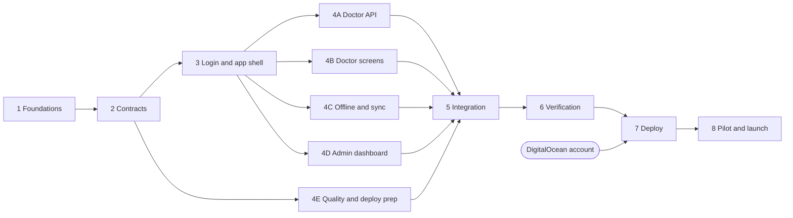

# Development and testing plan

This folder turns `docs/build-plan.md` into build phases. Each phase file stands on its own: a developer or an AI agent can start a fresh session with the files listed under **Read first** and work through it.

## Which decisions does the plan build on?

- One 60-second countdown covers the whole session. At zero it counts extra time; nothing moves on or closes by itself.
- Each step gets one rating from 1 to 5: needs improvement, basic, competent, proficient, excellent.
- Teaching pearls stay, private to each doctor.
- Doctors share one student list but see only their own sessions, ratings and pearls. The admin sees everything.
- We open the DigitalOcean account before launch.

**Assumptions.** Change these here if they are wrong, before phase 2 starts:

1. Extra time counts until the doctor taps Finish on Step 5. Time on the quick log is recorded separately.
2. The doctor can pause the countdown by tapping it, as in the prototype. Paused time is recorded and not counted as teaching time.
3. A session left open when the app closes resumes with the real time elapsed. If more than 15 minutes have passed, the app asks whether to resume or discard it.
4. "Year" applies to medical students only.
5. Department, designation and case type come from fixed lists, each with an "Other" option.

## What are the phases?

| Phase | File | Order | Size |
|---|---|---|---|
| 0 Allowed APIs | `00-allowed-apis.md` | First; research only | Done |
| 1 Foundations | `01-foundations.md` | In order | 2–3 days |
| 2 Contracts | `02-contracts.md` | In order | 3–4 days |
| 3 Login and app shell | `03-login-and-shell.md` | In order; two tracks side by side | 5–6 days |
| 4A Doctor API | `04a-doctor-api.md` | Parallel lane | 5–6 days |
| 4B Doctor screens | `04b-doctor-screens.md` | Parallel lane | 8–10 days |
| 4C Offline and sync | `04c-offline-sync.md` | Parallel lane | 7–8 days |
| 4D Admin dashboard | `04d-admin-dashboard.md` | Parallel lane | 8–10 days |
| 4E Quality and deploy prep | `04e-quality-ops.md` | Alongside 4A–4D | 3–4 days |
| 5 Integration and hardening | `05-integration.md` | In order | 5–7 days |
| 6 Verification gate | `06-verification.md` | In order | 2 days |
| 7 Deploy | `07-deploy.md` | In order; needs the DigitalOcean account | 2–3 days |
| 8 Pilot and launch | `08-pilot-launch.md` | In order | 2–3 weeks elapsed |

Sizes are working days for one builder working with AI agents, including tests. They are estimates to compare schedules, not promises.

## What must run in order, and what can run side by side?

**Phases 1–3 run in order.** Every later piece depends on the folder layout, the shared data rules, the database tables, login and the app shell. Built side by side, the pieces would guess at each other's shapes and need rework.

**Phase 4 runs as parallel lanes.** Phase 2 fixes the contracts: the data rules in `shared/`, the database tables, the API routes, the phone storage interface, and mock responses for each route. After that, each lane works in its own folders:

| Lane | Owns | Needs |
|---|---|---|
| 4A Doctor API | `server/src/routes/{students,sync,me}/`, `server/src/services/{students,sessions,pearls,sync}/` | Tables (2), login checks (3) |
| 4B Doctor screens | `app/src/doctor/` | Phone storage interface and its in-memory version (2), app shell and UI parts (3) |
| 4C Offline and sync | `app/src/offline/`, the PWA settings in `app/vite.config.ts` | Storage interface and sync contract (2), app shell (3), 4A's endpoints or phase 2's mocks |
| 4D Admin dashboard | `server/src/routes/admin/`, `server/src/services/reports/`, `app/src/admin/` | Tables and seed data (2), login checks and shell (3) |
| 4E Quality and deploy prep | `.github/`, `.do/`, `e2e/support/`, `scripts/`, `docs/runbooks/` | Foundations (1), contracts (2) |

**Phases 5–8 run in order.** Joining the lanes, checking the whole, deploying and the pilot each need everything before them. The DigitalOcean account must exist by the end of phase 6.

## How many lanes should run at once?

| Builders | Order | Working days before the pilot |
|---|---|---|
| One | 4A → 4B → 4C → 4D, with 4E between lanes | 50–63 |
| **Two (recommended)** | 4A with 4B, then 4C with 4D; 4E fills gaps | 35–45 |
| Four | All four lanes at once | 29–39 |

**Two lanes is the recommendation.** It halves phase 4, and 4C then connects to the finished 4A server instead of mock responses, which removes the riskiest mocks. Four lanes save a little more time but put four streams of pull requests in front of one reviewer, and every mock must be replaced in phase 5.

A lane can be a person or an AI agent session in its own git worktree. Review, not typing, sets the pace: each lane's pull requests need Sadia's review.

## What keeps parallel lanes from colliding?

- **One owner for contracts.** Changes to `shared/`, `server/src/db/schema.ts` or `app/src/data/repository.ts` go in their own small pull request, merge to `main` first, and every lane rebases.
- **One owner for migrations.** Lanes never run `drizzle-kit generate` themselves; they ask the contract owner, so migration files never conflict.
- **Folders per lane.** A lane edits files outside its folders only through a contract pull request.
- **Mocks are temporary.** Phase 5 replaces every mock and reruns all tests against the real server.

## How do we work day to day?

- Each lane has a branch and a git worktree, for example `git worktree add ../omp-4a lane/4a-doctor-api`.
- Pull requests stay small, one feature each, and merge into `main` only when CI passes and Sadia approves.
- Commits are authored by Sadia and pushed to `origin` (`sadiash/omp-digicoach`) only.
- The phase file's checklist is copied into the pull request description and ticked.

## When is a task done?

1. Tests cover every acceptance case in the phase file, and they pass.
2. `npm run check` passes: types, lint, unit and server integration tests.
3. The feature's Playwright tests pass on phone Chromium and phone WebKit (doctor screens) or desktop Chromium (dashboard).
4. The phase's anti-pattern checks find nothing.
5. The pull request checklist is ticked and Sadia has approved it.

## How do we test?

| Level | Tool | Covers | When it runs |
|---|---|---|---|
| Types and lint | TypeScript, Biome | Whole repo | On save, every push |
| Unit | Vitest | Timer maths, rating labels, data rules, sync queue order and retries, CSV formatting, password rules | Every push |
| Server integration | Vitest, Fastify `inject`, real PostgreSQL | Every route, permissions, privacy, resent data, database constraints, migrations | Every push |
| Component | Vitest, React Testing Library | Forms, rating control, student picker, timer display, update prompt | Every push |
| End-to-end | Playwright: Pixel 7 (Chromium), iPhone (WebKit), desktop Chromium | Full flows, offline, layout at 320–430 px, print, CSV, accessibility | Every pull request; the full set nightly |
| Real phones | One iPhone, one Android phone | Install, offline use over days, updates, storage | Phase 5, before deploy, before the pilot |
| Pilot | Two doctors, one week | Real ward use | Phase 8 |

### Which risks matter most, and what tests guard them?

| Risk | Guard |
|---|---|
| A session is lost when signal drops or the app closes | Unit: the outbox keeps items until the server confirms them. End-to-end: record a session offline, reload, go online, find it on the dashboard. |
| A resent session is stored twice | Integration: push the same session twice and find one row. End-to-end: the server stores a session but the phone never hears back; the phone resends; one row. |
| A doctor sees another doctor's sessions, ratings or pearls | Integration: a permission test for every doctor route. End-to-end: log in as a second doctor. |
| A doctor reaches admin data | Integration: every `/api/admin` route returns 403 to a doctor. |
| The timer drifts when the phone locks | Unit with a fake clock. End-to-end with Playwright's clock. |
| An app update reloads the page mid-session | Component: an update waiting during a session shows no prompt until the quick log is saved. Real phones: deploy during a session. |
| An iPhone deletes stored data | Real phones: installed app used across more than 7 days. In-app install guide. |
| Two doctors add the same student | Integration: the same PMDC number from two doctors gives one student with both sessions. |
| Wrong numbers in reports or the CSV | Integration: seeded data with known averages; the CSV is parsed back and compared. |
| A migration breaks production data | CI runs every migration on an empty database and on the previous release's seeded data. |
| Layout breaks on small phones | End-to-end at 320, 360, 390, 412 and 430 px: chips don't move when selected, and text boxes are never cut off. |

### Test data

- `shared/src/fixtures/`: factories with fixed seeds, so every run builds the same records.
- `npm run db:seed`: 12 doctors, 60 students and 400 sessions over 10 weeks, for dashboard work.
- End-to-end tests reset the database through a test-only command before each file, never through a public route.

### Environments

| Environment | Database | Used for |
|---|---|---|
| Local | PostgreSQL in Docker | Development, all tests |
| CI | PostgreSQL service container | Every push |
| Production | DigitalOcean Managed PostgreSQL | Pilot and study |

There is no staging server, to keep the cost to one app. Instead, the nightly check runs each new migration on the previous release's data. Before a release that changes the database, the migration also runs on a copy of production restored from the latest backup.
